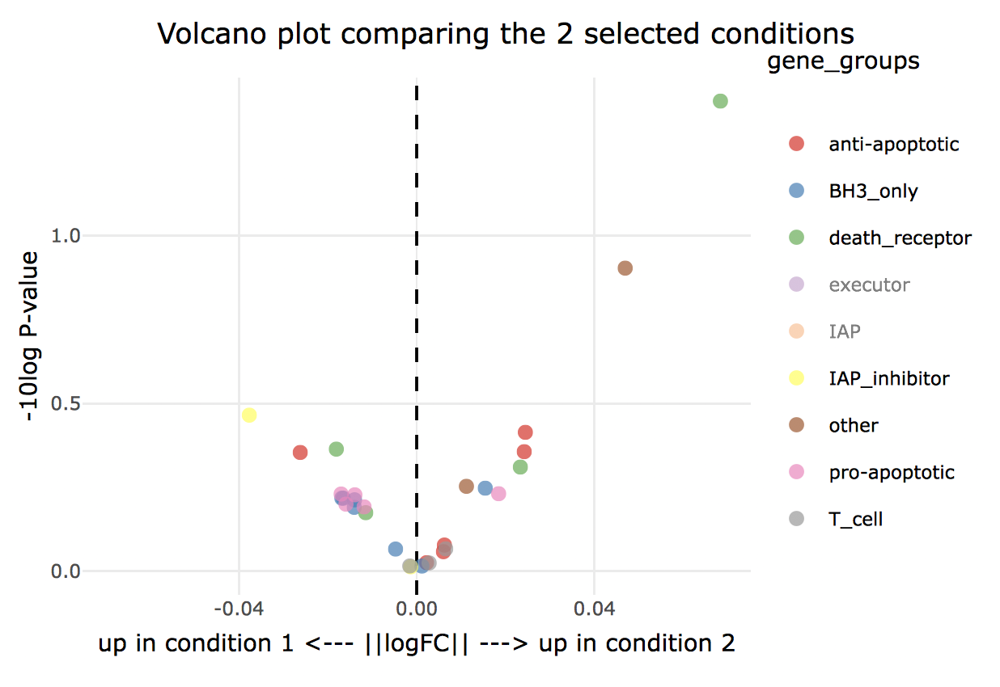

This application will fit linear models on gene expression data from multiplex ligation-dependent probe amplification experiments (see Eldering 2003) with repeated measurements and visualize log fold changes between two conditions in an interactive plotly volcano plot.

An example version running on the shinyapps server can be found on [https://martijnvanattekum.shinyapps.io/MLPA/]. See screenshot below:

